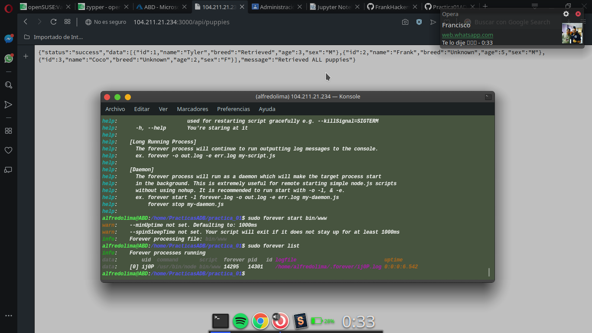

# Administración de base de datos.
## Práctica 1.
## Jiménez Lima José Alfredo
---
* Reporte de un link de su notebook a través de git
* Mostrar capturas de pantalla de su servidor y el resultado de su API
---
Resultado en terminal:
 
